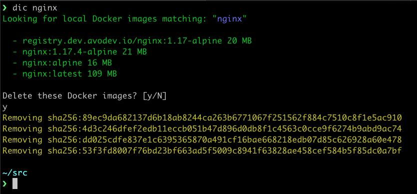

# dic (Docker Image Cleaner)

## Overview

Often I have found the need to destroy local Docker images based on partial
string match.  Weirdly enough the `docker` command line does not support this.

## Usage

Let's assume you have a few dozen docker images pulled and/or built locally.
And let's assume they're all tagged with `registry.revsys.com/my-cool-app` and some
various tags.  

To remove all images that match this you run: 

```shell
$ dic my-cool-app
```

It will search all of your local images matching the `QUERY` string. It will prompt you 
with all the images that match and give you an opportunity to confirm deletion or bail out
if you have too broad of a search. 

## Screenshot



## License

This is code is BSD licensed.  I've released this in the open, but I don't intend to put a 
ton of effort in maintaining it FYI. 

## Building

To build during development run `cargo build` to build a new optimized release run `cargo build --release`.

