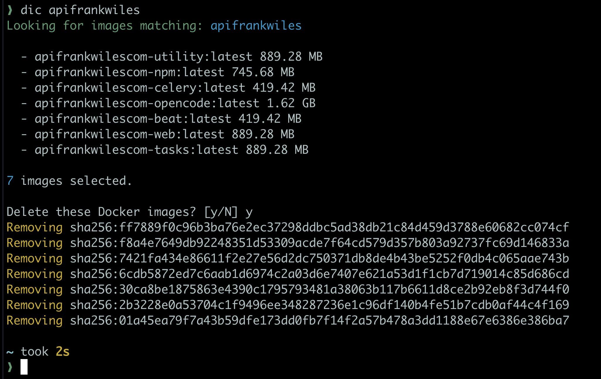

# dic (Docker Image Cleaner)

`dic` removes local Docker images whose repository tags contain a string. It shows every match and asks for confirmation before deleting anything.

> **Important:** Image removal is forced by default, matching the historical behavior of `dic`. Use `--no-force` to ask Docker to reject removals that require force.

## Screenshot



## Installation

### Homebrew (recommended)

```shell
brew install frankwiles/tools/dic
```

### Binary releases

Prebuilt binaries for Linux, macOS, and Windows are available on the [GitHub Releases page](https://github.com/frankwiles/dic/releases).

### Build from source

Building from source requires Rust 1.85 or newer:

```shell
git clone https://github.com/frankwiles/dic.git
cd dic
cargo build --release
```

The binary will be written to `target/release/dic`.

## Usage

Remove images with tags containing `my-cool-app`:

```shell
dic my-cool-app
```

Preview a case-insensitive match without prompting or deleting:

```shell
dic --ignore-case --dry-run my-cool-app
```

Delete without confirmation, while disabling Docker's forced-removal option:

```shell
dic --yes --no-force my-cool-app
```

Select every local image, including untagged images:

```shell
dic --all
```

`--all` cannot be combined with a query and still requires confirmation unless `--yes` is supplied.

```text
Usage: dic [OPTIONS] [QUERY]

Arguments:
  [QUERY]  String to match against image repository tags

Options:
      --all          Match every local image, including untagged images
  -i, --ignore-case  Match image tags without regard to ASCII case
      --dry-run      Show matches without prompting or deleting anything
  -y, --yes          Delete without asking for confirmation
      --no-force     Disable forced image removal (force is enabled by default)
  -h, --help         Print help
  -V, --version      Print version
```

Colors are disabled when output is redirected or the [`NO_COLOR`](https://no-color.org/) environment variable is set.

## Development

Run the local quality checks with:

```shell
cargo fmt --all -- --check
cargo clippy --all-targets --all-features -- -D warnings
cargo test --all-targets
```

CI runs these checks on Linux and macOS. Dependabot and a scheduled RustSec audit monitor dependencies.

## License

BSD-3-Clause. See [LICENSE](LICENSE).
